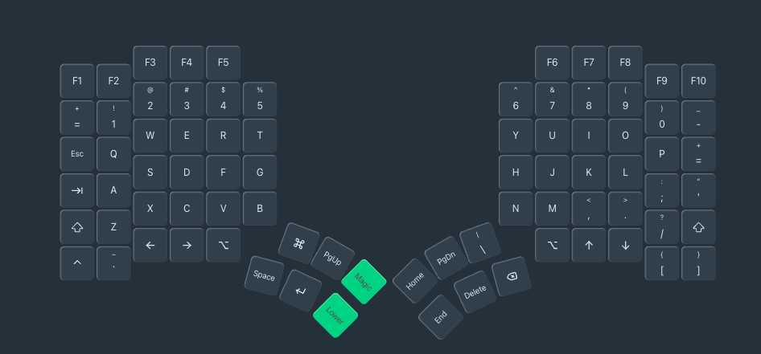
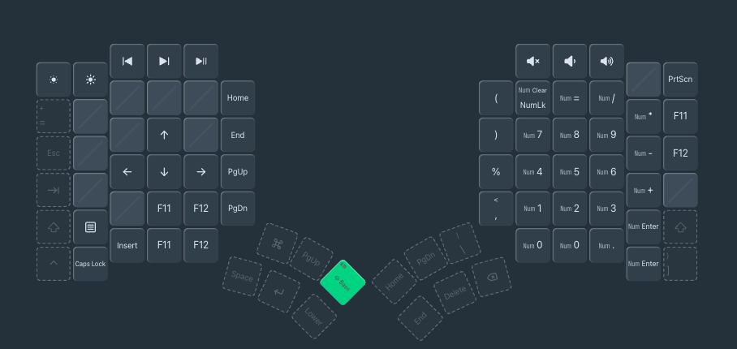

# Glove80 ZMK Config (with ZMK Studio)

Personal ZMK firmware config for the [MoErgo Glove80](https://www.moergo.com/collections/glove80-702702) keyboard with [ZMK Studio](https://zmk.studio/) support enabled.

## What this does

- Builds Glove80 firmware via GitHub Actions on every push
- Left half is built with **ZMK Studio** enabled (live keymap editing via browser)
- Right half is built with standard firmware
- Uses MoErgo's ZMK fork for Glove80 board definitions

## Files

| File | Purpose |
|------|---------|
| `build.yaml` | Build matrix — defines boards, snippets, and cmake args |
| `config/west.yml` | Points to MoErgo's ZMK fork (`moergo-sc/zmk`) |
| `config/glove80.keymap` | Keymap layout (exported from [my.glove80.com](https://my.glove80.com/)) |
| `config/glove80.conf` | ZMK config flags (`CONFIG_ZMK_STUDIO=y`) |
| `.github/workflows/build.yml` | GitHub Actions workflow using MoErgo's reusable build |

## Current Layout

### Base Layer

### Lower Layer

## How to update the keymap

1. Edit your layout at [my.glove80.com](https://my.glove80.com/)
2. Export as **ZMK keymap** (`.keymap` file)
3. Replace `config/glove80.keymap` with the exported file
4. **Important:** Add `&studio_unlock` to one key in the Magic layer (currently at the F6 position, top-right of Magic layer)
5. Push to GitHub — the Action builds firmware automatically

## How to flash

1. Download the `firmware` artifact from the latest [GitHub Actions run](../../actions)
2. It contains two files: `glove80_lh-zmk.uf2` (left) and `glove80_rh-zmk.uf2` (right)

### Flash each half:

1. **Unplug** the half from USB
2. **Hold the bootloader button** (small button on the inner edge, near USB port) while plugging USB back in
3. A USB drive appears in Finder (`GLV80LHBOOT` or `GLV80RHBOOT`)
4. **Drag** the matching `.uf2` file onto the drive
5. The keyboard reboots automatically with new firmware

### Flash both halves — left first, then right.

## Using ZMK Studio

After flashing:

1. Connect the **left half** via USB
2. Open **Chrome** (WebSerial required — Firefox/Safari won't work)
3. Go to [zmk.studio](https://zmk.studio/)
4. Click **Connect** and select the Glove80 serial device
5. Press the **studio unlock key** (Magic + F6 position) when prompted
6. Edit your keymap live in the browser

## Key decisions

- **MoErgo's workflow, not upstream ZMK** — The upstream `zmkfirmware/zmk` reusable workflow requires Zephyr 4.1 board qualifiers (`//zmk` suffix) that MoErgo's fork doesn't support yet. Using `moergo-sc/zmk/.github/workflows/build-user-config.yml@main` avoids this incompatibility.
- **MoErgo's ZMK fork** — Required for Glove80 board definitions. Set in `config/west.yml`.
- **`studio-rpc-usb-uart` snippet** — Only applied to the left half (`glove80_lh`). This enables the USB serial endpoint that ZMK Studio connects to.
- **`&studio_unlock`** — ZMK Studio requires an unlock key press for security. Mapped in the Magic layer so it's not accidentally triggered.

## Troubleshooting

- **ZMK Studio shows only Bluetooth serial ports?** — The keyboard must be connected via **USB**, not Bluetooth. ZMK Studio uses WebSerial which requires a wired connection.
- **No serial device in Chrome picker?** — Make sure you flashed the left half with the Studio-enabled firmware. Check that `/dev/cu.usbmodem*` exists (`ls /dev/cu.*` in terminal).
- **Build fails with "Board qualifiers not found"?** — Make sure `build.yaml` uses plain board names (`glove80_lh`, not `glove80_lh//zmk`) and the workflow points to `moergo-sc/zmk`, not upstream.

## References

- [Nicco's Glove80 ZMK Studio guide](https://nicco.io/blog/glove-80-zmk-studio)
- [ZMK Studio docs](https://zmk.dev/docs/features/studio)
- [MoErgo Glove80 layout editor](https://my.glove80.com/)
- [MoErgo ZMK fork](https://github.com/moergo-sc/zmk)
